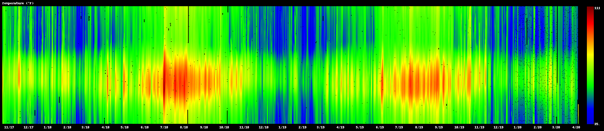
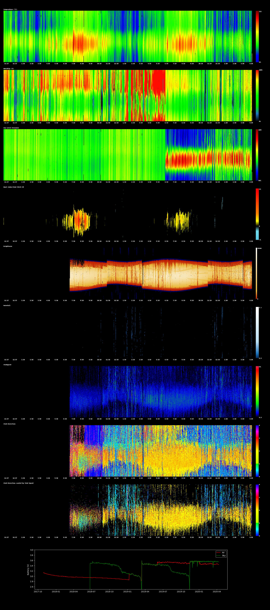

# WeatherFlow_DisplayHistory
This is a set of scripts that allows Weather Flow users to display all the entirety of their weather data in a single display.
It's not a dashboard display per-se because the nature of the display is such that there isn't much change in what it looks 
like over the course of a day. So the idea is that most people would only want to run this script once a day or perhaps
several times a week to see the overall weather and trends.
The display is broken down into ten panels where each shows a particular weather measurement over the entire period. In each panel, every vertical line represents an entire day with local noon in the middle and midnight at the top & bottom. 
Here's a sample of the temperature panel:



## Contents
**[Requirements](#requirements)**<br>
**[Installation Instructions](#installation-instructions)**<br>
**[Running the Script](#running-the-script)**<br>
**[More Advanced Topics](#more-advanced-topics)**<br>

## Requirements

* Python
  * this was written with Python 3 in mind, it currently seems to work with Python 2.7 but further down the road it may not.
  * having the python executable on your system search path is helpful but not strictly necessary.
* An SQL database containing the weather data
  * other database types should also work but would require script tweaks. 
* Basic text file editing skills

WeatherFlow Display History is largely platform agnostic and should run on any machine capable of running python with the necessary libraries. The SQL database doesn't have to be local to the platform you're running the script on.


## Installation Instructions

While the script doesn't require being in any particular place on the system, I'd recommend putting it in it's own folder as it does create some files.

1. If, like me, you're not particularly github savy, you can download the script by right clicking on this [link](https://raw.githubusercontent.com/StumbleRunner/WeatherFlow_DisplayHistory/master/WeatherFlow_DisplayHistory.py) and selecting "Save As"

2. Open a command prompt and enter the following command:
```
python -m pip install --upgrade pip
```
If python isn't on your search path that line (and subsequent python references) may need to have the path to python pre-pended to the them.

3. Once that process has finished, run: 
```
python -m pip install numpy matplotlib Pillow pymysql pandas
```

4. When that's done, go to the directory where you saved WeatherFlow_DisplayHistory.py and open it in a text editor. Go to the section marked #database info (about 23 lines in) and replace the default values with the ones specific for your database.
```
db_host = "localhost"
db_user = "user name"
db_pass = "password"
database= "Weather"
```

5. Then go down to next section in the file, marked #database tables, and replace those values with the correct table names in your database. If you have the same table for both your sky and air readings just use that name twice. 
```
airTable = "airobs"
skyTable = "skyobs"
```

6. Last bit of editing, go down to the section in the file marked #database field names and modify the default values with the actual field names used in your data tables.
```
timeField = 'TimeStamp' # assumed the same for both air and sky databases
tempField = 'AirTemp'
presField = 'SeaLevelPressure'
humdField = 'RelHumidty'
hidxField = 'FeelsLike'
battField = 'Battery'   # assumed the same for both air and sky databases
lghtField = 'Lux'
rainField = 'PrecipAccum'
rateField = 'RainRate'
windField = 'WindGust'
wdirField = 'WindDirection'
```

7. At this point everything should be good to go, there are additional things you may want to tweak but just make sure everything works at this point before taking off into the jungle.


## Running the Script
From a command prompt, navigate to the directory where you put WeatherFlow_DisplayHistory.py script. (This wasn't mentioned before but you need to have write permissions in that directory)
Enter the following command:
```
python WeatherFlow_DisplayHistory.py
```
Go get a cup of coffee and come back in 5 minutes to an hour depending on the speed of the your machine, amount of data you have, and possibly the amount of network bandwidth (assuming your weather database isn't local). 
If things are running properly, you'll see lines like this start popping up on your screen:
```
Loading libraries
Initializing
Loading data
Processing data
...building time/date arrays for air data
...building time/date arrays for sky data
...loading air image arrays
...loading sky image arrays
...loading battery arrays

Plotting data
...temperature
...humidity
...pressure
...heat index
...brightness
...rainfall
...wind speed
...wind direction
...batteries
```
When the script is done running it will pop up a window on your display using whatever the default picture viewer is (Photos, Preview, xv, etc). If you don't have a display (or even if you do) the resulting picture is saved off in the local directory under the name WeatherPlot.png

Here's a sample of the final image with about 2 1/2 years of data


## More Advanced Topics
#Changing the colors and units
Each plot has it's own color gradient and each color gradient is created by setting color values at particular plot value points. For example, the temperature plot by default has seven temperature points where the color values are set and between those points the colors are interpolated. The seven temperatures are 0,45,60,80,100, and 110(°F) and colors at those points are deep blue, blue, green, yellow, red, and dark red. The colors are defined as RGB triples where the amount red, green, and blue in the color is specied by values from 0-255; so bright red would look like (255,0,0) and dark blue would look like (0,0,64).
In the script these color gradients and value points are specified in the section labelled # color scale variables
```
TempColorBins=[0,45,60,80,100,110]
TempColors=[(0,0,64),(0,0,255),(0,255,0),(255,255,0),(255,0,0),(128,0,0)]
HumdColorBins=[0,15,30,50,80,100]
HumdColors=[(0,0,0),(31,120,193),(0,221,0),(0,255,0),(255,255,0),(255,0,0)]
FeelColorBins=[-32,-27,-19,-2,0,2,5,14,22]
FeelColors=[(109,31,98),(0,0,255),(0,120,193),(112,219,237),(0,0,0),(255,255,0),(255,132,0),(255,0,0),(137,0,0),(255,0,0)]
LuxColorBins=[0,4,400,30000,200000]
LuxColors=[(0,0,0),(0,0,85),(191,27,0),(234,184,57),(255,255,255)]
PresColorBins=[980,996,1012,1028,1044,1060]
PresColors=[(0,0,64),(0,0,255),(0,255,0),(255,255,0),(255,0,0),(128,0,0)]
RainColorBins=[0,0.01,0.1,0.3,0.5,1,3]
RainColors=[(0,0,0),(5,43,81),(10,67,124),(31,120,193),(81,149,206),(186,223,244),(255,255,255)]
WindColorBins=[0,5,15,30,50,60]
WindColors=[(0,0,0),(0,0,255),(0,255,0),(255,255,0),(255,0,0),(163,82,204)]
wDirColorBins=[0,45,90,13,180,225,270,315,360]
wDirColors=[(0,0,255),(0,255,255),(0,255,0),(119,255,0),(255,255,0),(255,119,0),(255,0,0),(255,0,255),(0,0,255)]
```
If your database uses different units than mine (which is an odd mix of imperial and whatever the WeatherFlow default units are) this is where you'd make the change. You can set as many or as few plot value points as you want, but make sure you have a color for every value point or the script will likely crash.
Special note: The "Feels Like" plot doesn't show absolute temperature, it shows the difference between absolute and feels like. I felt that made it easier to spot those effects rather than trying compare it to the largely similar temperature plot.
Other special note: There's a variable just below the color gradients section for converting meters per second into miles per hour for the wind speed. If you prefer meters per second, set this value 1.0.
